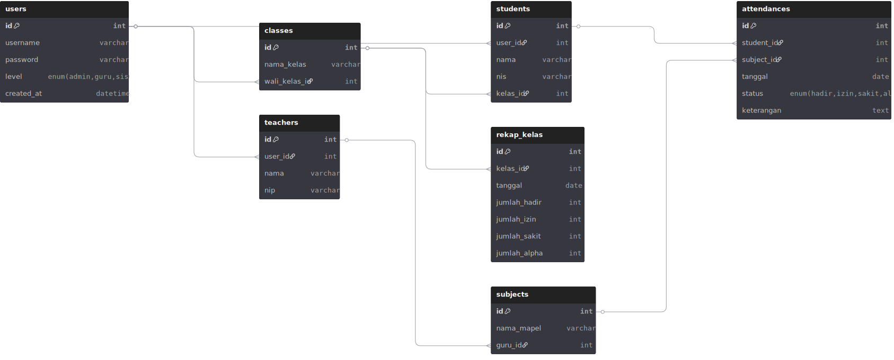

# 📚 Absensi Siswa - Web Application

Sistem informasi absensi siswa dengan 3 level user (Admin, Guru, Siswa), dilengkapi fitur rekap dan laporan per kelas berdasarkan status kehadiran: **Hadir, Izin, Sakit, Alpha**.

## 🎯 Fitur Utama
- 🔐 Login multi-level (Admin / Guru / Siswa)
- 📅 Pencatatan absensi siswa per mata pelajaran
- 📊 Rekap absensi otomatis per kelas
- 🧾 Laporan bulanan absensi siswa

## 👥 Role User
| Level  | Akses                                                                 |
|--------|-----------------------------------------------------------------------|
| Admin  | Manajemen data guru, siswa, kelas                                     |
| Guru   | Input kehadiran siswa, lihat rekap                                    |
| Siswa  | Lihat histori kehadiran pribadi                                      |

## 📁 Struktur Folder
- `/docs` → Flowchart & Diagram Basis Data
- `/public/tampilan` → Gambar UI
- `/src` → Kode program

## 🛠️ Teknologi
- PHP / MySQL / SB Admin 2 (template admin)
- DBdiagram.io (untuk database)
- draw.io (untuk flowchart)

## 📸 Tampilan

## 📌 Catatan
Project ini dibuat untuk kebutuhan sekolah atau institusi pendidikan berbasis web.

## 🤖 Flowchart

## 🪢 Diagram DB

## ✍️ Dibuat oleh

**Attar - Kelas XI RPL**  
Tahun: 2025  
Lisensi: MIT
